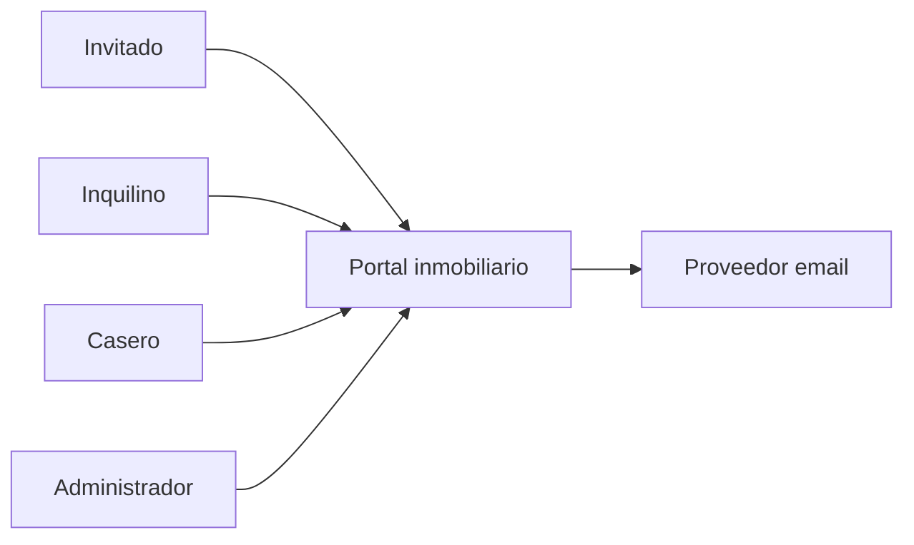

# Contexto y alcance

## Objetivo
Construir un portal inmobiliario con arquitectura hexagonal y clean code que permita gestionar usuarios, inmuebles, anuncios, reservas y resenas, con autenticacion, activacion por email y borrado logico.
Proyecto personal tratado con estandar de producto real.

## Diagrama de contexto

## Actores
- Invitado
- Registrado
- Inquilino
- Casero
- Inquilino y casero (usuario con ambos roles)
- Administrador

## Reglas generales
- Los usuarios dados de baja no se eliminan de la base de datos.
- Los roles pueden combinarse (inquilino y casero).
- Los anuncios pueden ser mensuales y/o indefinidos.
- El alquiler es mensual. A partir de 12 meses se considera indefinido.
- Solo el administrador puede eliminar inmuebles de la base de datos.
- Las resenas eliminadas dejan de ser visibles pero no se borran fisicamente.

## Autenticacion y activacion
- Registro con username, email, password, datos personales y avatar.
- Email de activacion al registro.
- Login con email o username.
- Si el usuario esta de baja, se envia email de reactivacion.

## Fotos
- Inmuebles y anuncios deben tener fotos.
- Un anuncio hereda fotos del inmueble por defecto.
- Se permite subir fotos especificas del anuncio si se desactiva la herencia.
- Debe existir una portada.

## Soft delete
- Todas las entidades relevantes usan borrado logico mediante deleted_at.
- Los datos borrados logicamente no son visibles para usuarios no admin.
- El administrador puede consultar historico.

## Email
- Envio real de emails (proveedor a definir mas adelante).
