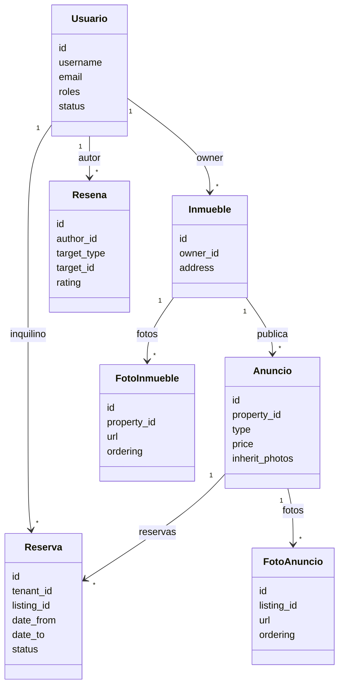

# Dominio

## Entidades

### Usuario
- Atributos: id, username, email, password_hash, roles, status, avatar_url, deleted_at, activated_at
- Roles: TENANT, LANDLORD, ADMIN
- Status: PENDING_ACTIVATION, ACTIVE, DEACTIVATED
- Reglas:
  - El usuario dado de baja no se elimina fisicamente.
  - El usuario DEACTIVATED no es visible para usuarios no admin.
  - Login con email o username.
  - Un usuario puede tener ambos roles (TENANT + LANDLORD).

### Inmueble
- Atributos: id, owner_id, address, features, deleted_at
- Reglas:
  - Solo admin puede borrar fisicamente un inmueble.

### Anuncio
- Atributos: id, property_id, type, price, status, deleted_at, inherit_photos
- Tipos: MENSUAL, INDEFINIDO, MENSUAL_Y_INDEFINIDO
- Reglas:
  - Publicacion requiere al menos 1 foto.
  - Por defecto hereda fotos del inmueble.

### Reserva
- Atributos: id, tenant_id, listing_id, date_from, date_to, status, deleted_at
- Estados: SOLICITADA, ACEPTADA, RECHAZADA, CONFIRMADA, CANCELADA
- Reglas:
  - No puede solapar reservas en estado ACEPTADA o CONFIRMADA.
  - Solo tenant o admin puede solicitar.

### Resena
- Atributos: id, author_id, target_type, target_id, rating, comment, deleted_at
- target_type: INMUEBLE, INQUILINO
- Reglas:
  - Solo si la reserva ha finalizado.
  - Solo autor o admin puede eliminar (soft delete).

### FotoInmueble
- Atributos: id, property_id, url, caption, ordering, is_cover, status, deleted_at
- Reglas:
  - Una unica portada por inmueble.
  - Orden definido para la galeria.

### FotoAnuncio
- Atributos: id, listing_id, url, caption, ordering, is_cover, status, deleted_at
- Reglas:
  - Solo se usa si inherit_photos es false.
  - Una unica portada por anuncio.

## Value Objects
- Email: formato valido y unico
- Username: unico, longitud controlada
- Money: EUR, mayor o igual a 0
- DateRange: from < to y minimo 30 dias
- Address: provincia, ciudad, comunidad, calle, cp
- RoleSet: combinacion valida de roles

## Invariantes
- Reserva no solapa con otra aceptada o confirmada.
- Resena solo tras finalizar alquiler.
- Anuncio publicado requiere fotos.
- Usuario dado de baja no se elimina.
- Solo admin puede borrar inmuebles fisicamente.
- La reserva es mensual y el alquiler pasa a indefinido si supera 12 meses.

## Borrado logico
- Todas las entidades principales usan deleted_at.
- Los registros con deleted_at se excluyen por defecto.
- status se usa para activacion (PENDING_ACTIVATION, ACTIVE).

## Diagrama de dominio

